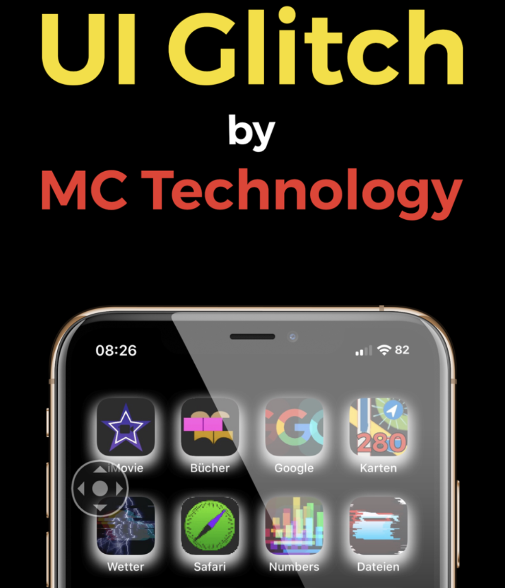
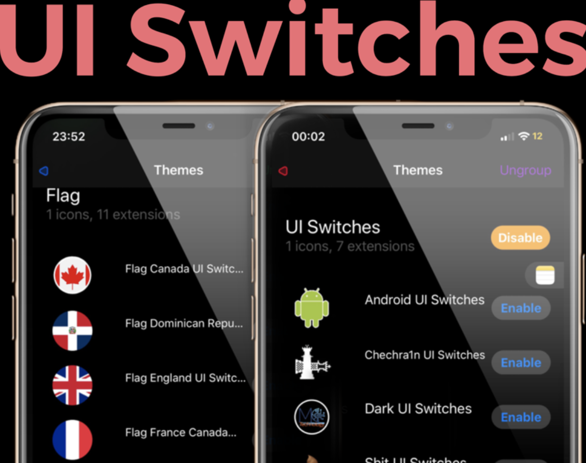

 

<h1 align="center">Hola yo soy Marcos - MC Technology </h1>

<h3 align="center"><tr><td>

[][twitter]
[][instagram]
[][facebook]

</td></tr></h3>

### Actualmente estudiando un Master en Bioinformática 💻 en alemania
- 🦾 Me encanta el el levantamiento de pesas!
- 🤓 Actualmente estoy aprendiendo de todo un poco XD!
- 👾 Tengo mucha curiosidad y por eso empiezas a estudiar programación
- 🗒  Actualmente estoy muy obsecionado con el aprendizaje de vimscript

 

---

<h3 align="center"> Últimos proyectos realizados</h3>

<tr>
<td>

[][gm]

</td>
<td> <h4 align="left"> <a href="https://github.com/mctechnology17/gm" target="_blank"><code>GitManager</code></a> </h4>
  

    
ver mas...

    GitManager es un asistente multiplataforma que se puede combinar
    con su zsh/bash/fish/powershell o con su editor
    vim/vi/nvim/Gvim/MacVim.

  
 </td>
</tr>
<tr>
<td>

[][youtuberepo]

</td>

<td> <h4 align="left"> <a href="https://github.com/mctechnology17/youtube_repo_mc_technology" target="_blank"><code>YouTube Repo</code></a> </h4>
  

    
ver mas...

    Un buen repositorio para compartir mi conocimiento.
    y ayudar a la comunidad de desarrollo en
    youtube con lo que he aprendido hasta ahora.
    Las contribuciones también son bienvenidas: D!

  
 </td>
</tr>
<tr>
<td>

[][vimtools]

</td>
<td> <h4 align="left"> <a href="https://github.com/mctechnology17/vimtools" target="_blank"><code>vimtools</code></a> </h4>
  

    
ver mas...

    VimTools es un complemento para complementar su editor
    texto / código favorito vim, vi, nvim, Gvim o MacVim.

  
 </td>
</tr>
<tr>
<td>

[][jailbreakrepo]

</td>
<td> <h4 align="left"> <a href="https://mctechnology17.github.io/" target="_blank"><code>Jailbreak repo</code></a> </h4>
  

    
ver mas...

    Una contribución a la comunidad de Jailbreaker

  
 </td>
</tr>
<tr>
<td>

[][uiglitch]

</td>
<td> <h4 align="left"> <a href="https://repo.packix.com/package/com.mctechnology.uiglitch/" target="_blank"><code>UI Glitch</code></a> </h4>
  

    
ver mas...

    UI Glitch está aquí !!!

    Dale a tu iPhone un aspecto diferente con UI Glitch.
    La familia UI de MC Technology! Creado para los amantes de la
    personalización de la interfaz de usuario!
    Con UI Glitch puedes obtener una combinación exquisita para
    complementar tus temas!
    Más de 20 tonos con diferentes grados de opacidad y colores!
    Compatibilidad con miles de temas! Incluye un tema animado exclusivo!

  
 </td>
</tr>
<tr>
<td>

[][uiswitches]

</td>
<td> <h4 align="left"> <a href="https://repo.packix.com/package/com.mctechnology.uiswitches/" target="_blank"><code>UI Switches</code></a> </h4>
  

    
ver mas...

    Interruptores de interfaz de usuario
    Dale a tu iPhone un aspecto diferente con UI Cambia la familia UI de
    MC Technology! Creado para los amantes de la personalización de
    interfaz de usuario!
    Cómo utilizar los interruptores de la interfaz de usuario? Instale la
    extensión de la interfaz de usuario de Snowboard y Snowboard desde el
    repositorio de Spark.

  
 </td>
</tr>

 
 

---

<h3 align="center"> Lenguajes de programación y herramientas</h3>

    
    
    
    
    
    
    
    
    
    
    
    
    
    
    
    
    

---

[twitter]: https://twitter.com/mctechnology17
[youtube]: https://www.youtube.com/c/mctechnology17
[instagram]: https://www.instagram.com/mctechnology17/
[facebook]: https://m.facebook.com/mctechnology17/
[reddit]:https://www.reddit.com/user/mctechnology17

[vimtools]: https://github.com/mctechnology17/vimtools
[jailbreakrepo]: https://mctechnology17.github.io/
[uiglitch]: https://repo.packix.com/package/com.mctechnology.uiglitch/
[uiswitches]: https://repo.packix.com/package/com.mctechnology.uiswitches/
[gm]: https://github.com/mctechnology17/gm
[youtuberepo]: https://github.com/mctechnology17/youtube_repo_mc_technology
